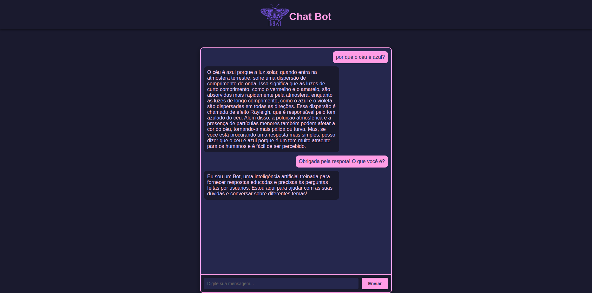

# 🦋 ChatBot com Ollama



#

**` 🚀 Funcionalidades:`**

🎯 **Objetivo:**

Criar uma aplicação web que integra backend e frontend, consumindo a API Ollama para criar um chatbot funcional com IA.

💻 **Tecnologias utilizadas:**

- Python e Flask - construção do chat e consumo de API;

- JavaScript - integrar as entradas na página web com as respostas fornecidas pela IA;

- HTML e CSS - customização da página;


##

<a href="https://chatbot-1-7d9d.onrender.com"> **` 🌐 Acesse o ChatBot clicando aqui!`**</a>

---

## 🚀 Para Rodar o Projeto Localmente:

Siga os passos abaixo para configurar e executar o projeto na sua máquina:

### **1️⃣ Pré-requisitos**
- Tenha o [Python](https://www.python.org/downloads/) instalado (versão 3.8 ou superior).

### **2️⃣ Clone e acesse o repositório**

**``Execute os comandos abaixo no terminal:
``**
```bash
git clone https://github.com/Rafaella-Monteiro/ChatBot.git
cd ChatBot
```

### **3️⃣ Crie e ative um ambiente virtual:**

**`Para criar o ambiente virtual, use:`**
```bash
python -m venv venv
``` 
**`Ative o ambiente virtual de acordo com seu sistema operacional:`**

- Linux/Mac: 
 ```bash
 source venv/bin/activate
```

- Windows: 

```bash 
venv\Scripts\activate
```

## **4️⃣ Instale as dependências:**

**`Com o ambiente virtual ativo, instale as dependências do projeto:`**

```bash
pip install -r requirements.txt
```
## **5️⃣ Execute o projeto e acesse no navegador:**

**`Inicie o servidor Flask com:`**

```bash
python main.py
```

**`Por fim, abra o navegador e acesse:`**

```bash
http://127.0.0.1:5000
```

##
### 🦋 Feito por Rafaella Monteiro
